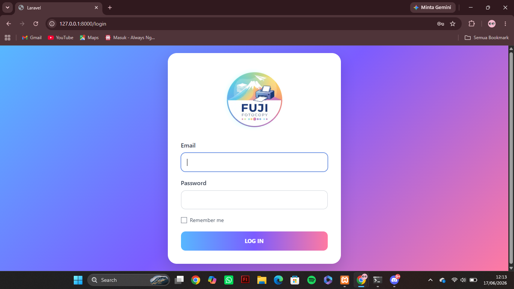
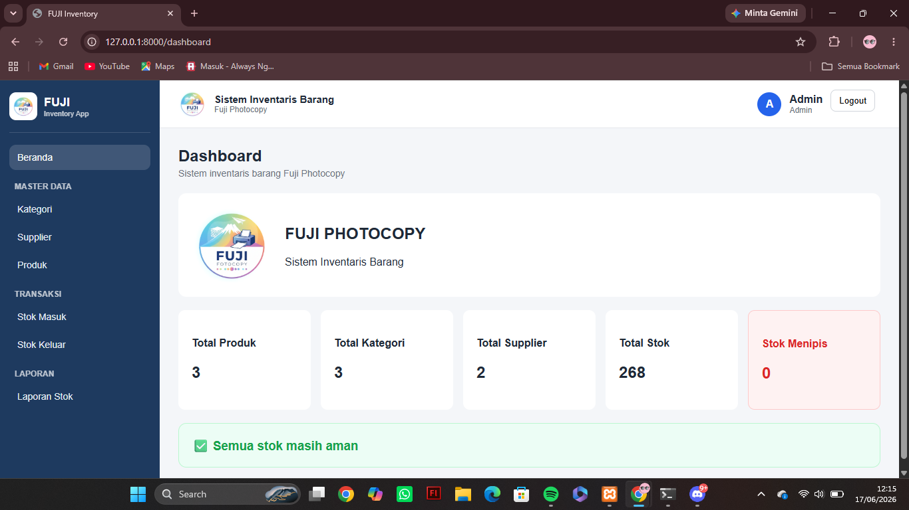
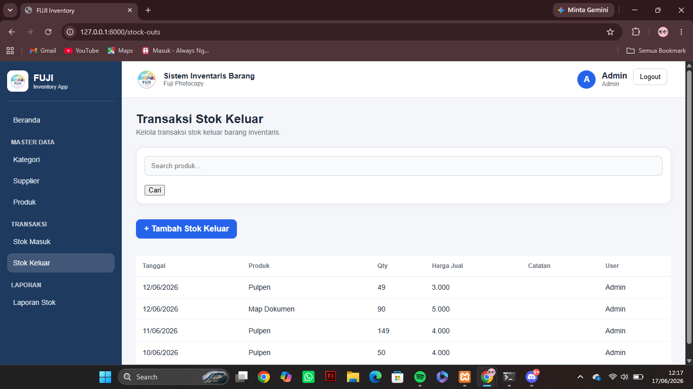
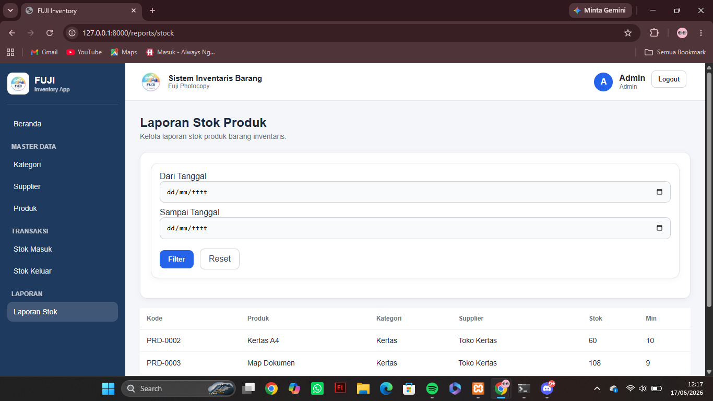

# 📦 KP Inventory

Inventory Management System for Fuji Photocopy built with Laravel 12.

## ✨ Features

- Authentication (Admin & Staff)
- Dashboard
- Category Management
- Supplier Management
- Product Management
- Product Image Upload
- Stock In
- Stock Out
- Low Stock Notification
- Reports
- Role-Based Access

---

## 🛠 Technologies

- Laravel 12
- PHP 8.2
- MySQL
- Blade
- Git & GitHub

---

## 📷 Screenshots

### Login



### Dashboard



### Stock In


### Stock Out



### Reports



---

## 🚀 Installation

```bash
git clone https://github.com/dzulfikri323-cmd/kp-inventory.git

cd kp-inventory

composer install

cp .env.example .env

php artisan key:generate

php artisan migrate

php artisan serve
```

---

## 👤 Author

Dzulfikri

GitHub:

https://github.com/dzulfikri323-cmd